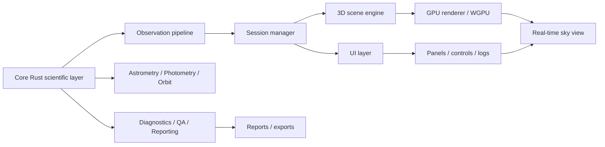

# Audit d'état et perspectives de développement

> Date : 2026-09-16  
> Projet : Celestia / observatory_core  
> Type : audit technique, applicatif et roadmap

## 1. Résumé exécutif

Le projet est aujourd'hui dans un état de base fonctionnelle solide et cohérente : il s'agit d'un noyau Rust de simulation et de traitement astronomique, structuré en modules spécialisés, avec démonstrations CLI et plusieurs briques validées par tests. Le cœur scientifique est avancé, mais l'application n'est pas encore un logiciel complet avec interface graphique réelle ni moteur 3D de rendu réaliste exploitable en production.

En l'état, le projet a les qualités suivantes :
- architecture modulaire claire,
- logique astronomique et de traitement d'images structurée,
- batterie de modules testés,
- base de CLI et d'API suffisante pour un développement continu.

Les limites principales sont :
- absence d'UI native fonctionnelle,
- absence de moteur 3D GPU réel,
- besoin de cohérence entre les modèles scientifiques et les composants de visualisation,
- besoin de validation de perf / stabilité / ergonomie sur des scénarios réels.

Le meilleur levier de progression est de consolider le noyau scientifique, puis de brancher progressivement une interface moderne basée sur un moteur de rendu 3D dédié, idéalement en Rust avec une base WGPU / renderer graphique réaliste.

---

## 2. État actuel constaté

### 2.1. État du cœur applicatif

Le dépôt contient un package Rust nommé `observatory_core` avec une organisation modulaire très avancée. Le cœur prend en charge :
- épémérides / orbital motion,
- détermination d'orbite initiale,
- exoplanètes / transits,
- acquisition / monture / sécurité,
- astrométrie,
- photométrie,
- qualité d'image,
- séquences d'observation,
- événements / reporting,
- correction de pointage,
- flux de réduction / détection de sources,
- détection de transitoires,
- classification stellaire et catalogue.

Le code est structuré autour de fichiers de module indépendants (ex. `iod.rs`, `catalog.rs`, `stellar.rs`, `pointing.rs`, `photometry_calib.rs`, `pipeline.rs`, `transient.rs`, `scheduler.rs`, `runtime.rs`, `app.rs`, `service.rs`).

### 2.2. Vérification réelle

La validation live a été effectuée sur le projet avec les commandes suivantes :

```powershell
cd F:\Celestia\nextgen\rust_app
$env:CARGO_TARGET_DIR = 'C:\rust-target\celestia'
cargo test --quiet
cargo run --release --bin astrometry_cli -- --point 100,200,12.0,45.0 --point 150,250,12.5,45.5 --output-dir out --json
```

Résultat vérifié :
- `97 tests passés`
- `0 échec`
- sortie CLI astrométrique valide et stable

Cela montre une base de code bien avancée du point de vue de la compilation et du contrôle de régression.

### 2.3. État de l'UI

L'UI actuelle est quasi inexistante en tant qu'application réelle :
- le projet est encore principalement orienté CLI / library,
- les modules sont exposés via `src/bin/*` avec des outils d'analyse de données,
- il n'y a pas encore de véritable front-end de visualisation 3D interactive,
- il n'y a pas de couche de rendu GPU multi-plateforme qui permette un point de vue astronomique immersif.

### 2.4. État du moteur 3D réaliste

Le moteur 3D réel n'est pas encore présent comme composant fonctionnel de l'application. Ce qui existe est plutôt :
- modèles physiques / orbitaux,
- géométrie astronomique,
- calculs de pointage et d'optique,
- structures de donnée aptes à la visualisation.

En revanche, il manque encore :
- scène 3D complète,
- camera contrôlée,
- rendu d'étoiles, planètes, atmosphères, effets de lumière,
- terrain / ciel / profondeur / mouvement temporel,
- shaders avancés,
- pipeline de rendu réel sur GPU,
- intégration UI/3D synchronisée.

---

## 3. Forces du projet

### 3.1. Base scientifique solide
Le noyau couvre beaucoup de domaines utiles pour un logiciel d'observation astronomique :
- stabilité orbitale et calcul dynamique,
- géométrie de caméra / astrométrie,
- photométrie et réduction,
- suivi de changements transitoires,
- qualité de données et diagnostics.

### 3.2. Architecture modulaire cohérente
Les modules sont séparés par responsabilités, ce qui facilite :
- les tests unitaires,
- la maintenance,
- la composition progressive des fonctionnalités,
- l'extension par sous-composants.

### 3.3. Exécution vérifiable
Le fait que le projet compile et passe de nombreux tests donne une base crédible pour la suite.

---

## 4. Faiblesses et blocages actuels

### 4.1. Interface utilisateur absente
Le produit est actuellement très orienté traitement de données plutôt que usage final. Il manque une couche d'interaction de type :
- navigation céleste,
- vues d'observation,
- panneaux de contrôle,
- planification de sessions,
- visualisation temps réel.

### 4.2. Moteur 3D non mature
Aucune vraie scene 3D réaliste n'est encore implémentée ; ce point est probablement le principal écart entre le noyau scientifique et le produit final souhaité.

### 4.3. Validation sur données réelles insuffisante
Le code est validé sur des scénarios synthétiques et sur des briques unitaires, mais il manque encore :
- jeux de données étoiles / images réelles,
- benchmark de perf GPU,
- benchmark de précision sur séquences d'astroimagerie,
- tests d'intégration sur environnement d'observation réel.

### 4.4. Risque de divergence entre modèle mathématique et rendu visuel
Sans couche de rendu unique, il y a un risque de double logique :
- côté calcul scientifique,
- côté IA ou rendu visuel.
Il faut centraliser les courants de données et les conventions (coordonnées, échelle, éphémérides, systèmes de référence).

---

## 5. Perspectives de développement

### Phase 1 — Stabilisation du noyau (court terme)
Objectifs :
- consolider tests et API,
- normaliser la représentation des données (coordonnées / unités / conventions),
- enrichir les modules de qualité de données,
- stabiliser les sorties JSON de diagnostics et d'observation.

Résultat attendu :
- un moteur scientifique stable, lisible et facilement interopérable.

### Phase 2 — Interface utilisateur fonctionnelle (moyen terme)
Objectifs :
- créer une app desktop de base,
- UI d'observation avec panneaux et logs,
- gestion de configuration,
- affichage de résultats et diagnostics,
- navigation simple des cibles et séquences.

Technologies plausibles :
- `egui` pour l'UI,
- `eframe` pour la fenêtre native,
- `serde` / JSON pour flux de configuration,
- pipeline de rendu partiel 2D avant 3D.

### Phase 3 — Moteur 3D réaliste (moyen/long terme)
Objectifs :
- rendu GPU de scènes astronomiques,
- étoiles, planètes, objets de surveillance,
- atmosphères, effets de lumière, gradients de ciel,
- navigation et caméra libre,
- labels et overlays scientifiques,
- animation du temps / orbites / rotation.

Technologies adaptées :
- `wgpu` (rendue moderne et multi-plateforme),
- `egui` pour l'UI overlay,
- `nalgebra` ou mathématiques vectorielles internes,
- système de scène 3D modulaire, structure dédié au rendu.

### Phase 4 — Produits avancés
- mode observation temps réel,
- planification de campagnes par intelligence de séquence,
- suivi d'objets transitoires,
- IQA / qualité de réduction et auto-diagnostics,
- export de sessions et de rapports scientifiques.

---

## 6. Architecture cible recommandée



### Architecture fonctionnelle cible
- noyau scientifique Rust stable,
- couche de scène 3D indépendante,
- UI de contrôle et surveillance,
- moteur de rendu sur GPU,
- interface de données unifiée.

---

## 7. Recommandations productives

### Recommandation majeure
Ne pas viser un "monolithe 3D complet" en premier. Préférer la stratégie suivante :
1. consolider le noyau scientifique,
2. créer une app desktop de base avec tests d'intégration,
3. ajouter un moteur de rendu 3D progressive et modulaire,
4. brancher les données observatoires sur la scène 3D.

### Paliers de validation
- validation de compilation et tests unitaires,
- validation d'UI fonctionnelle sur écran,
- validation d'affichage 3D avec scène minimale,
- validation de navigation camera et orbitographie,
- benchmark perf sur cartes graphiques standard.

---

## 8. Risque principal

Le risque principal n'est pas scientifique : c'est l'absence de cohérence entre le système de calcul astronomique et la couche visuelle. Sans architecture claire, le projet peut se fragmenter entre :
- calculs de précision,
- backend de données,
- rendu 3D,
- interface utilisateur.

La bonne stratégie est donc de poser un contrat de données fort :
- types communs,
- système de coordonnées unique,
- conventions de temps / échelle / unités,
- API d'interface entre moteur et UI.

---

## 9. Conclusion

Le projet est aujourd'hui dans une phase raisonnablement avancée sur le plan du noyau scientifique et de la logique applicative. Les bases sont solides, les modules existent, et les tests confirment un niveau de maturité technique respectable.

En revanche, le développement de l'application est encore majoritairement centré sur le calcul et l'analyse, pas sur l'expérience finale utilisateur ni sur le rendu 3D réaliste. C'est précisément là que la prochaine vague de développement doit être concentrée.

La meilleure trajectoire est :
- stabiliser le cœur,
- construire la couche UI desktop,
- introduire un moteur 3D réaliste par étapes,
- intégrer progressivement les données astronomiques au rendu visuel.

Une fois ce schéma posé, le projet peut évoluer vers une application d'observation astronomique crédible, exploitable et ouverte à la visualisation immersive, à l'IA d'automatisation, au suivi de campagnes et au rendu de scènes célestes réalistes.

---

## 10. Recommandation de priorisation

### Priorité immédiate
- `CLI / API / tests`
- normalisation des conventions de coordonnées
- stabilisation des sorties JSON

### Priorité courte
- `UI desktop légère`
- `affichage de campagne / diagnostics`
- `navigation de base`

### Priorité moyenne
- `moteur 3D WGPU`
- `scène astronomique`
- `camera / navigation / labels`

### Priorité longue
- `moteur réaliste complet`
- `visualisation temps réel / rendu avancé`
- `surveillance / études transitoires / campagnes automatisées`
